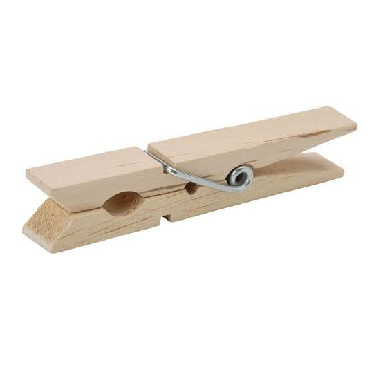

# A1 – [Topic]

## Objective

## Analyze
## I used these portfolios: https://natekarau61.github.io/Engineering-Portfolio/  and https://www.alexandre-allonas.fr/
On both websites, I was completely able to find all of their works in less than 20 seconds upon entering their sites for the first time as they had "project sections on their home screens.
Also on both websites, they have a list of components in their projects and what they worked on. However, only one (natekarau61) provided engineering drawings good enough to reproduce the work without extra assistance.
Both websites have only the final outcomes and not their reasoning or problem solving through the project.
These portfolios both use a minimum of words to get their message across and it works for them. I can understand everything that they are trying to say quickly and easily.

Product: Spring-loaded clothespin

The product selected for this consists of two opposing clamping members and one wire spring. The design is primarily mechanical because its function depends on the transmission of force through rigid members and the elastic movement of a spring.

The product was selected because its primary mechanical behavior can be analyzed using static equilibrium and the moment relationship (M=Fd), while the spring provides the elastic force required to maintain the clamping load.

The purpose of this machine is to apply a clamping force to an object and a supporting line by converting an applied force into rotational motion of two opposing jaws and using a spring to maintain the resulting clamping force after the force is removed.

 The forces that govern this force are the lever arm principle and Hooke's law for springs.
 Variables include: Force applied to each arm and the spring constant.
 

 Each arm functions both as a jaw and lever arm. The short end is used to clamp on the clothes/line and the long end is taped for more mobility and is used as the lever arm to open the jaw.
 The spring stores energy using Hooke's law and the force applied to the lever arms.

 U.S. Patent No. 2,466,284 by Leslie W. Stinne
 Two alternatives are alligator clips and spring clamps.
 The original designer ran the springs up the side of each arm for retention in place and aligned with the center of the force.

## Decide
This portfolio, on opening, should have links to a projects, about me, a contact me page, and a resume/ work experience page.
I removed the "this is the portfolio overview" text under the portfolio overview as it is irrelevant to anyone viewing the site.
For every assignment, I will include precise dimensional units, clear assumptions,  and labeled steps.

## Communicate

