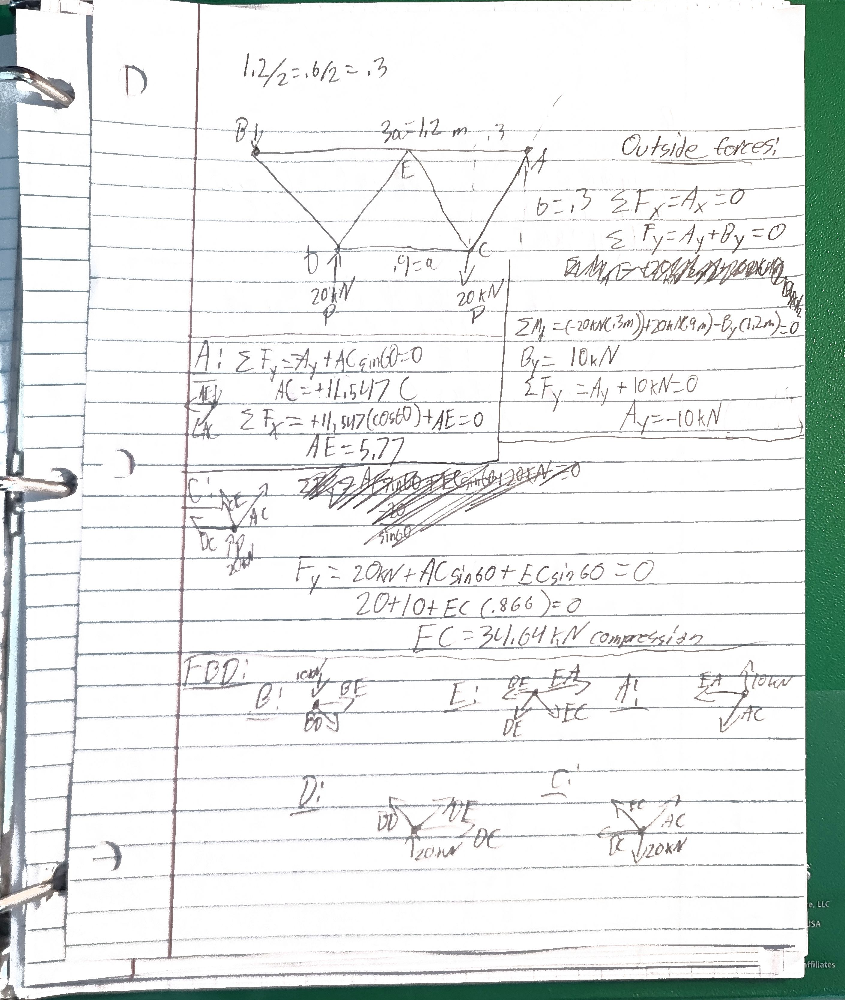
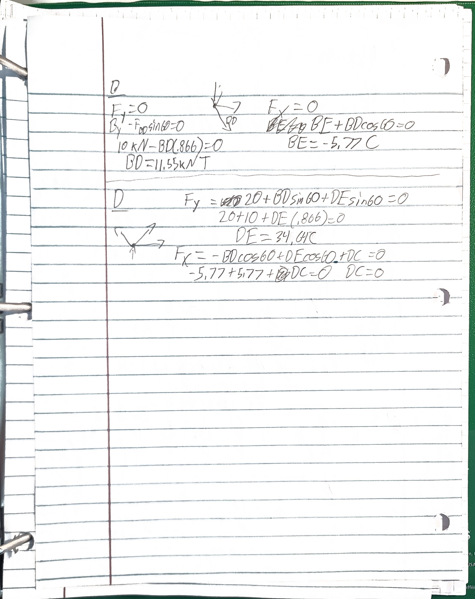
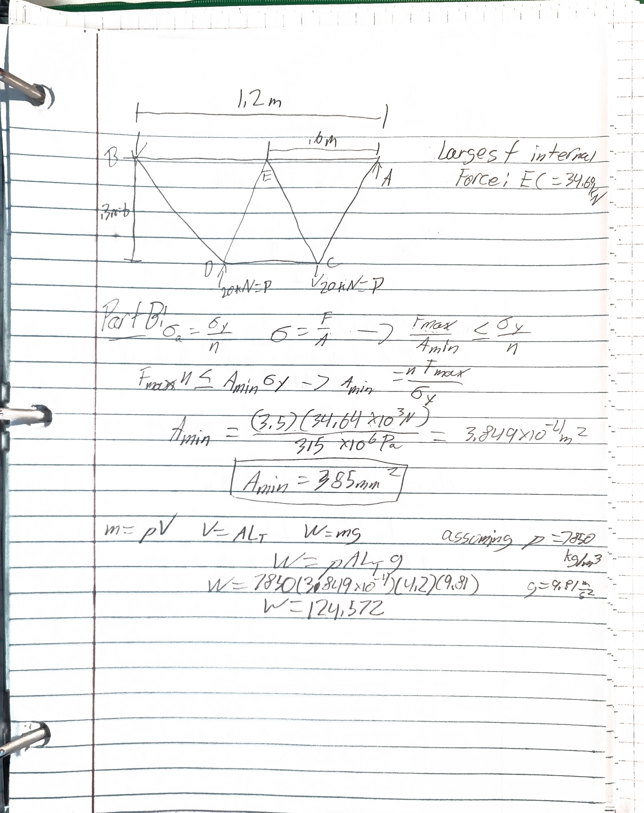
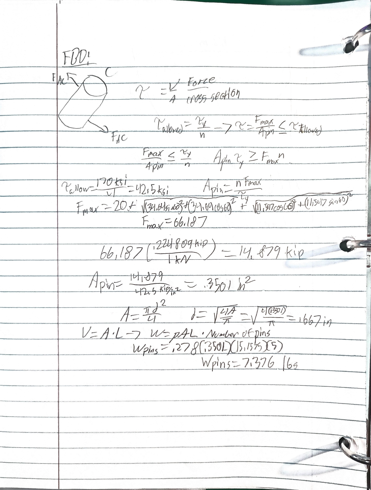
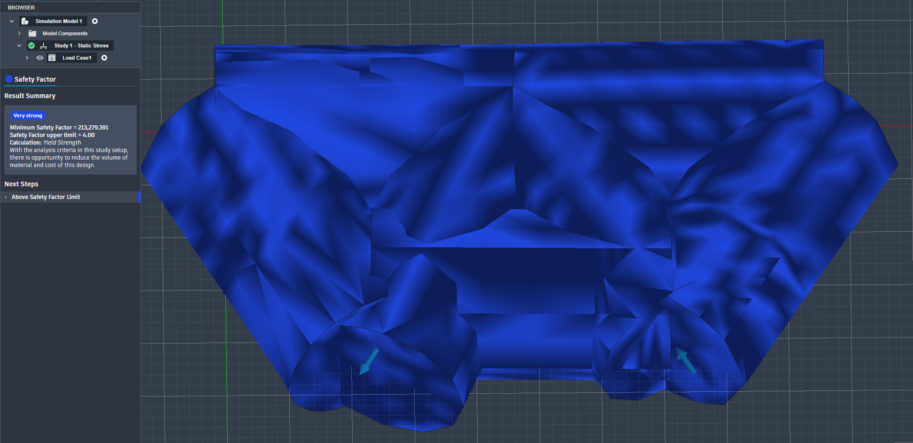
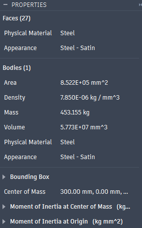

# A2 – Truss Stress Analysis

# Objective
The objective of this assignment is to create a truss that can hold when a force of 20 kN is being applied to two different joints and is also held by a roller and a pin.

# Analyze
## Step 2

I designed a simple planar truss using the required geometric constraints of a=0.4m and b=0.3m, with point A acting as a pin support and point B acting as a roller support. I chose a warren truss geometry with a diagonal member because this configuration has been proven to be effective in real world applications before me. I calculated the length of each truss member and used free body diagrams to calculate the forces on said trusses.

### Part B
Largest internal force:

- F_max=34.64kN
- Member EC is in compression
- Factor of safety: n=3.5
- Material: A500 structural steel
- Yield strength of A500 Grade B:
- sigma_y = 315MPa
- All truss members have the same cross-sectional area.

Unknown:
- Minimum required cross-sectional area: A_min = ?
- Approximate weight of the truss: W=?

I used the largest internal force found from the truss analysis to determine the minimum cross-sectional area required for the members. I applied the A500 steel yield strength and the required safety factor of 3.5 to remain below the allowable stress. After determining the required area, I calculated the approximate weight of the truss.

## Step 3
### Unknowns
- allowable shear stress
- minimum pin cross section area
- pin diameter
- weight of all pins
### Knowns
- yield shear strength = 170ksi
- safety factor = 4
- larest pin reaction =  kN
- pin connection = single shear
- pin density = .278 lb/in^3
- total length of truss is 4.2 m

I designed the connecting pins based on the largest force acting on a pin and the requirement that the connection use a single-shear configuration. I used the specified hardened tool steel yield shear strength of 170 ksi and a safety factor of 4 to calculate the minimum required pin area and corresponding diameter. I then used the pin dimensions and the specified density of 0.278 lb/in^3 to estimate the combined weight of all the pins.

## CAD Modeling

I created a CAD model of the truss using the dimensions and cross-sectional areas determined from the analytical calculations. The truss members were modeled as one part, while the pins were modeled as a cylindrical component with the calculated dimensions and the member cross-sectional area. I then used Creo's material properties to model the appropriate steel and recieve ata from the modeling software.

### Pin CAD File 
https://a360.co/4cq0drm
### Truss CAD File
https://a360.co/4zUKFWF
### Member CAD File 
https://a360.co/4x7ihOx

## 2157 Only Section
### Part 1
- Expect buckling first as A500 Steel is a ductile material.
- A500 Steel is a ductile material
- Assuming that the joints will not fail the steel is the only thing that can fail and because it is ductile the most likely result is a brace/member collapsing in on itself or crumpling.
- More braces or a different material integrated into a support web of some kind inside of the truss.
### Part 2
- Shear failure, with only one shear plane. The lack of axial force makes it so that the only modes of failure possible are bending and shear, and hardened carbon  steel is not very likely to bend before breaking. A way to ease the stress on the pin would be to use a clevis and pin or some form of fastener on the other side to create a second shear plane.

##
- This work for the 2157 only section took me about two hours total, and the calculations for the rest of the assignment took about 4 hours. The CAD Modeling took about 2-3 hours including downloading and linking files.

## Sources:
- https://pandapipe.com/blog/a500-steel-properties/
- https://www.xometry.com/resources/3d-printing/ductile-failure/
- https://www.ssfwashers.com/blog/whatarethecommonfailuremodessheartensilefatigueofboltsinservice
- https://www.portlandbolt.com/technical/faqs/bolt-shear-strength-considerations/
- https://www.eng-tips.com/threads/combined-stress-in-pin-aisc-reference.442040/

# Decide
For this assignment, I designed a lightweight planar truss using ASTM A500 Grade B structural steel. The truss was designed around the required dimensions a=0.4, b=0.3, and an applied load of P=25 at joints C and D. I selected a simple truss consisting of five joints and seven members in the design of a Warren truss so that the structure remains relatively simple for CAD modeling and analysis. The design consists of a lower brace and upper member that are connected by braces creating three triangle shapes between them.

# Communicate
During the process of this project, I made several mistakes, including but not limited to: an original less efficient design with a square and a diagonal brace, mathematical errors, some CAD errors and several documentation lessons learned. My original design was flawed in the fact that it would take up more space and still be less strong than my current design. I realized once I had my pin calculations done that my mathematical stress calculations were incorrect as the pin and cross section figures made no sense. I spent several attempts in Fusion learning how to constraint and configure stress analysis as I had never done that in Fusion before.I learned how to calculate the shear forces acting on a pin, how to calculate with a safety factor, and calculate a necessary cross section.
