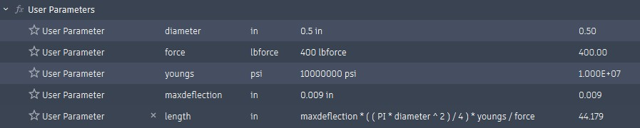
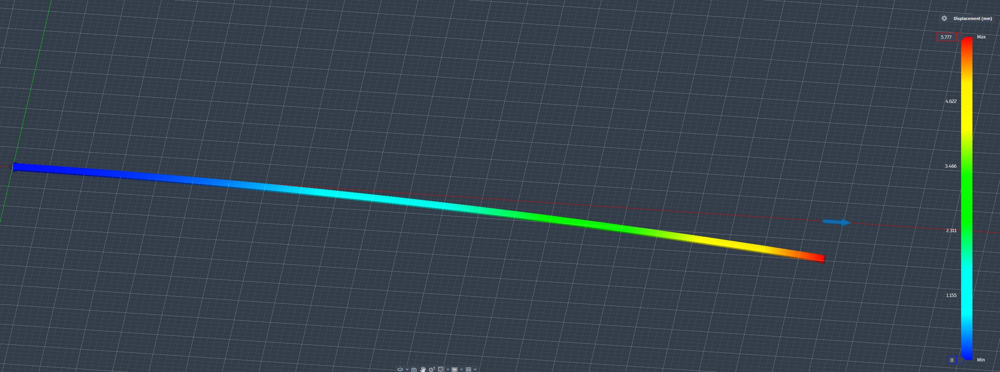
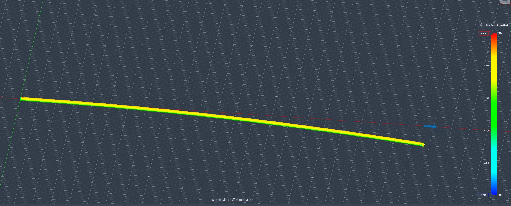
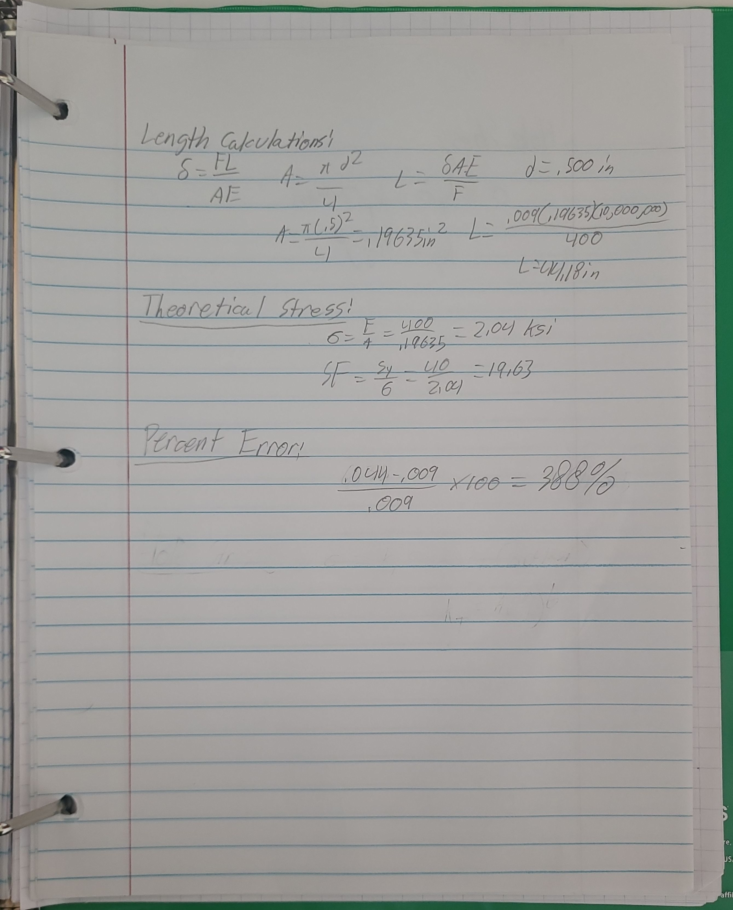
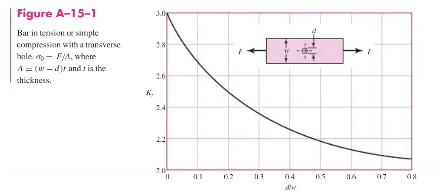
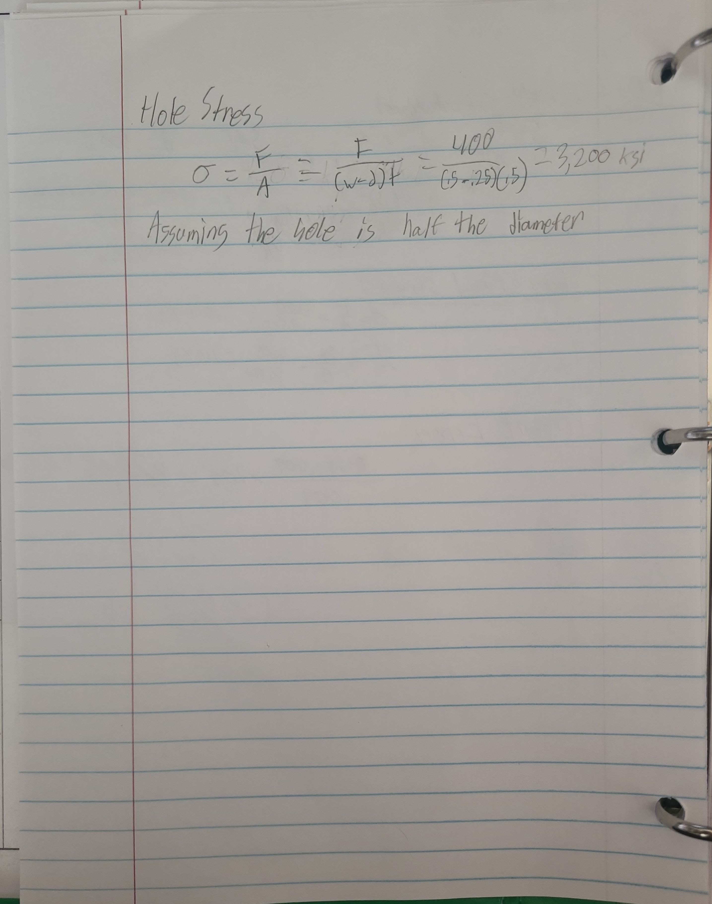
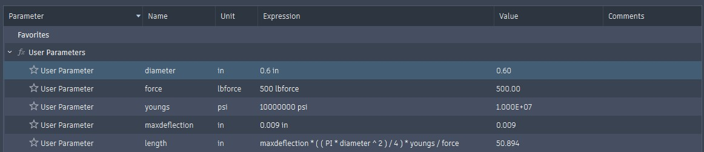
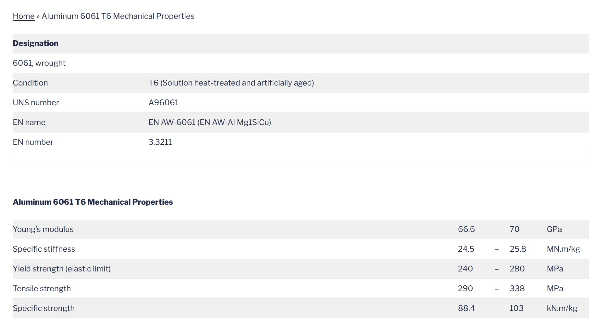

# A3 – [Topic]

## Objective
The Objective of this assignment is to design and analyze an aluminum rod under a certain amount of forces. Learning how to model parametrically is one of the goals of this assignment. We will also learn to make displacement maps, Von Mises maps, and do FEA analysis.

## Analyze
#### Parametric Setup

#### Max Displacement Map

#### Von Mises Map

#### Safety Factor & Max Deflection

The safety factor with this design is 11.972 at minimum, and max stress according to the Von Mises map is 3.824 Ksi. My max deflection from fea is .044 inches, which results in a 388% percent error. My most likely reason for this large discrepancy would either by an incorrectly applied force or boundary. I would still rather trust the CAD result as it is the result that includes material analysis and more accurate variable/math work. Using the model that predicts a higher error rate is also a good idea as it forces more adjustment to the side of safety.

#### Backup Hand Calcs

#### Aluminum Hole Stress Source
https://www.scribd.com/document/127259571/Tablas-Kt 

When using this source for hole stress, my bar still passes safety factor as the force is less than the max force found in my von mises graph.

### 2157 only section
I will change my parameters to 500 lb, .6 inches in diameter. I predict that this will cause the bar to lengthen as the increase in force outweighs the increase in width/height.

It turns out that I was correct as the bar increased to 50.1 inches long.

#### Changed Parametrics

## Decide
To decide which kind of aluminum to use, I consulted this website: https://www.modulusmetal.com/aluminum-6061-t6-mechanical-properties/

### Aluminum Material Properties Table

## Communicate
During this project I learned quite a bit during my 6 or so hours of working on this project consistently. I learned the different methods of stress charting and how to exploit Fusion 360 to my advantage. I also learned about the Peterson charts, which are very helpful and will be in the future. 

### CAD Download Link
- https://a360.co/46NyqOd 
