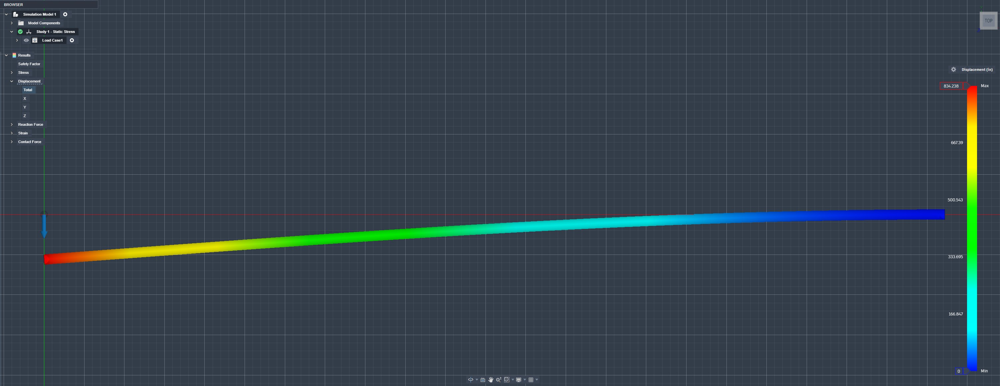
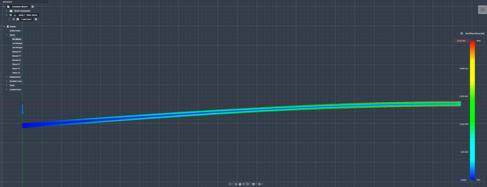

# A3 – [Topic]

## Objective
The Objective of this assignment is to design and analyze an aluminum rod under a certain amount of forces. Learning how to model parametrically is one of the goals of this assignment. We will also learn to make displacement maps, Von Mises maps, and do FEA analysis.

## Analyze

### Safety Factor

The safety factor with this design is .014 at minimum.
## Decide

## Communicate

