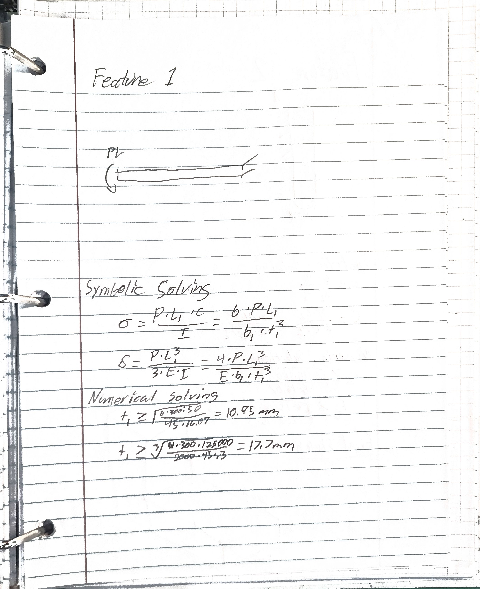
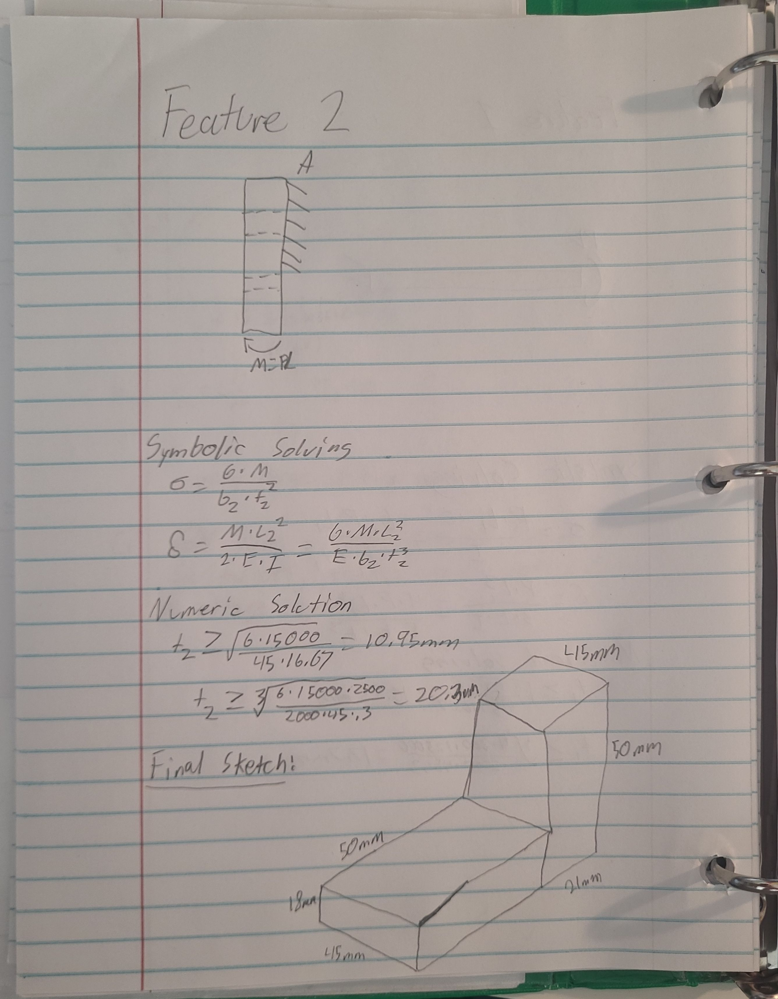
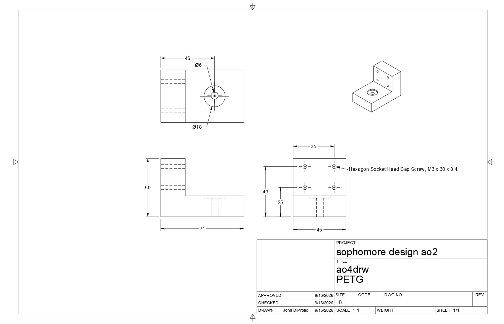

# A4 – [Topic]

## Objective
The Objective of this project is to deisgn and structurally verify a motor mount in two directions, via CAD design, skeches, and calculations.

## Analyze

### Feature 1

#### Knowns
- P = 300 N
- L_1 = 50 mm
- b_1 = 45 mm
- delta = .30 mm
  
#### Unknowns
- Thickness 1
- Max Bending Moment
  
#### Feature 1 Paper Calcs & FBD

### Feature 2

#### Knowns
- M = 15000 N*mm
- L_2 = 50 mm
- b_2 = 45 mm
  
#### Unknowns
- Thickness = t_2

#### Feature 2 Paper Calcs & FBD

### CAD
#### Link To Download CAD
https://a360.co/4hxzgVq 

#### Drawing

## Decide

I decided to use PETG for its balance of impact resistance and layer adhesion.

## Communicate

This project took my about five hours to complete in work time. I learned that plastic must be very thick to prevent much deflection of any kind with an applied torque force. I also 
