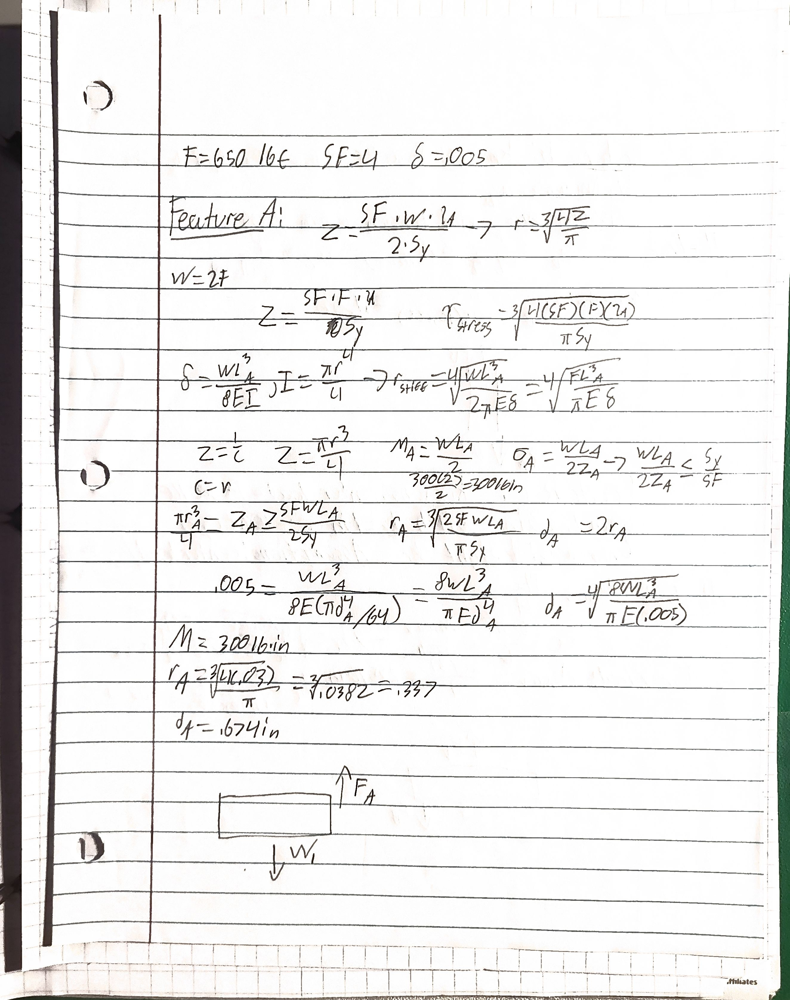
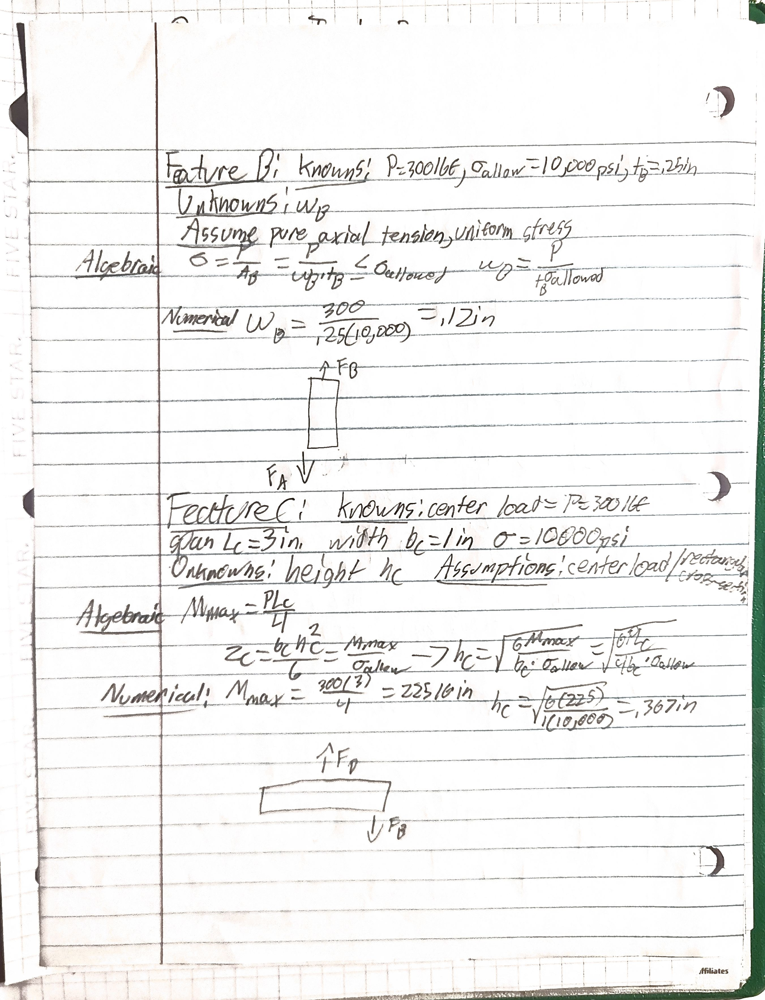
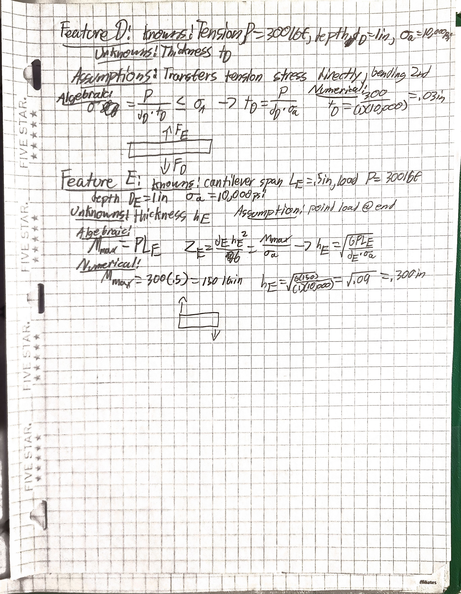
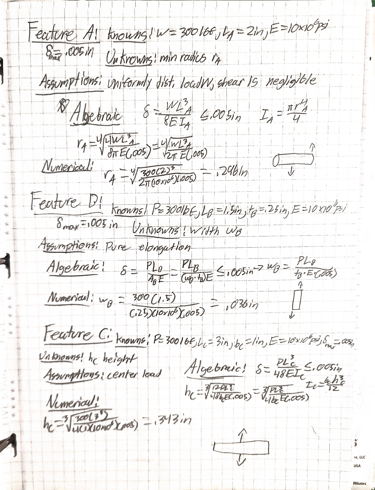
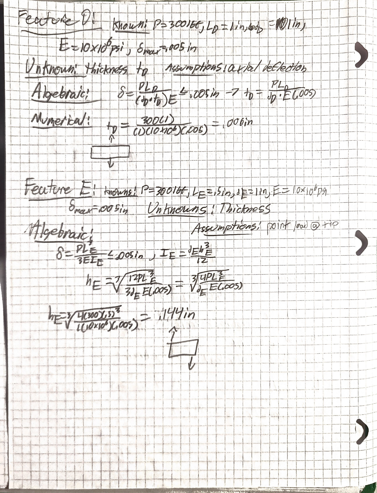
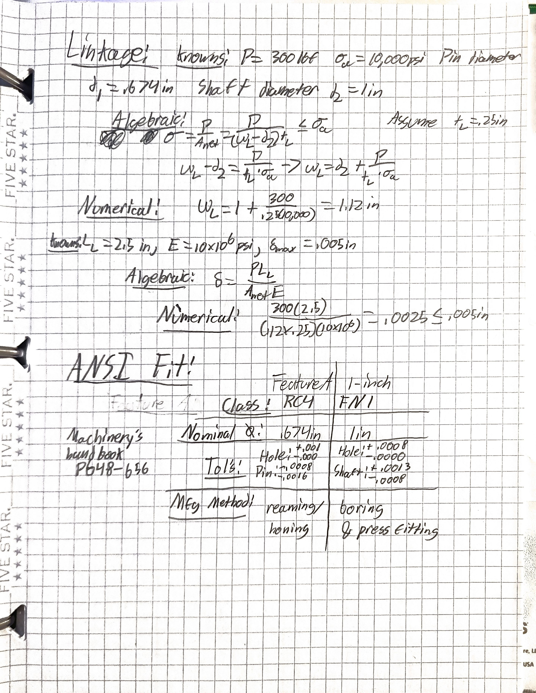

# A5 – [Topic]

## Objective
The objective of this assignment is to design bracket dimensions by applying stress and stiffness analysis to each feature and comparing the two.

## Analyze
### Part 1

### Part 2

### Linkage

## Decide
### Choices Made While Designing
- Design Load 600 lbf
- Bracket Load Distribution: Symmetrical split resulting in P = F/2 = 300 lbf
- Material Selected: Aluminum 6061-T6
- Yield Strength: 40,000 psi
- Modulus of Elasticity E = 10.0* 10^6
- Factor of Safety 4.0
- Allowable Stress 10,000 psi
- Maximum Deflection Limit 0.005 in per feature
- Feature A Length 2.0 in
- Feature B Length 1.5 in
- Feature B Thickness 0.25 in
- Feature C Span 3.0 in
- Feature C Base Width 1.0 in
- Feature D Height 1.0 in
- Feature D Depth 1.0 in
- Feature E Overhang Span 0.5 in
- Feature E Depth 1.0 in
- Direct Shear Failure ignored
- Shear deformations are assumed negligible
- Aluminum 6061-T6 is assumed to be isotropic, homogeneous, and linearly elastic
- Deflections are assumed irrelevant
- Linkage Thickness 0.25 in
- Linkage Length 2.5 in center-to-center hole distance.

## Communicate
### Governing Failure Mode
Normal stress governed all final dimensions over stiffness. For Feature A, the stress radius r = 0.337 in exceeded the stiffness requirement r = 0.296 in by .041 in.
### Error Propagation
An initial calc error applied the full 600 lbf load to a single bracket rather than 300 lbf per side. This doubled internal bending moment on Feature C from 225 lb*in to 450 lb*in. A late catch resulted in having to redo several numerical calcs. 
### Assumption Sensitivity
The analysis assumed that direct shear stress and shear deflections were negligible. If this assumption were modified to include transverse shear deformation, short components like Feature E would exceed the .005 in deflection limit. Feature E would thus need to be thickened.
