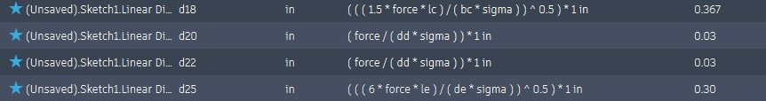

# A6 – [Topic]

## Objective
Build a parametric 3D CAD model of the bracket and generate a fully dimensioned engineering drawing with standard ANSI fit tolerances.

## Analyze
#### Parametric Sheet List
Name,Unit,Expression,Value,Comments,Favorite
la,,( 2 in ) / in,2,,false
lb,,( 1.5 in ) / in,1.5,,false
tb,,( 0.25 in ) / in,0.25,,false
lc,,( 3 in ) / in,3,,false
bc,,( 1 in ) / in,1,,false
ld,,( 1 in ) / in,1,,false
dd,,( 1 in ) / in,1,,false
le,,( 0.5 in ) / in,0.5,,false
de,,( 1 in ) / in,1,,false
sigma,,10000,10000,,false
force,,( 300 lbforce ) / lbforce,300,,false
modulus,,10000000,1e+07,,false
maxdef,,( 0.005 in ) / in,0.005,,false

#### CAD Files
https://a360.co/4z5pkbE
https://a360.co/4hyQT6b

## Decide

## Communicate
To control the radius of Feature A, I used the maximum bending stress equation. I established global variables for the applied load F = 300, cantilever span L = 2, and allowable stress Sigma = 10000. The dimension for the cylinder's radius was defined in the sketch using the expression =( (2 * F * La) / (pi * Sigma) )^(1/3).
On the engineering drawing, I applied a .005 tolerance to the internal height of the slot. This dimension defines a functional mating surface requiring a close running fit to ensure accurate location and minimal play. I applied a looser .02 tolerance to the overall exterior width of the bracket housing. The exterior width is a non-critical feature that does not interface with any other mechanical components.  A stricter approach would increase tool wear, inspection time, and overall manufacturing cost no benefit.   
